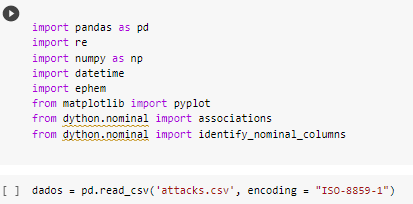
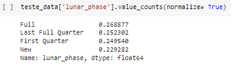
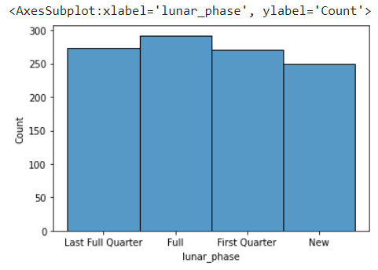
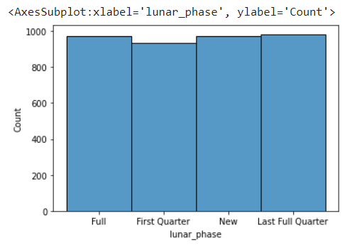

# shark_atacks_data_cleaning
limpeza de uma base de dados para realizar inferências sobre a existência ou não de correlação entre ataques de tubarão e fase lunar

Foram necessárias as bibliotecas abaixo para esta análise:

Ao importar a base verificamos que existiam colunas com informação repetidas e colunas sem informação:

Realizando a checagem de tipo e valores nulos verificamos que o arquivo era muito irregular com muitas linhas sem informação:

Já convertemos a coluna Date para tipo data pois vai ser usada em equações que demandam este tipo.
Também verificamos o final do arquivo e verificamos que boa partes dos valores vazios vinham da parte final do arquivo:

Realizamos a exclusão do final do arquivo que contimham valores vazios e das linhas repetidas.
As linhas Unamed eram meras informaçoes de até aonde algum usuário anterior havia analisado, então também foram excluidas.
foi feita a checagem de outra coluna que iamos usar a 'Fatal (Y/N)' , foram verficadas as inconsistêcnias e corrigidas:

Por fim ao checar novamente os dados podemos ver que as linhas estão mais consistentes e uniformes:

Agora era a hora de começar a análise para usar os dados da fase da lua recori a biblioteca de dados astronômicos EPHEM
e o algorítimo abaixo foi desenvolvido modificando um algorítimo que gerava uma listagem de todas as datas iniciais das 4 fases principais e 4 intermediárias para o ano informado.
Assim modificamos para receber uma data e devolver a fase principal da lua correspondente a data informada.

Assim rodamos unando um map na coluna Date e criamos a coluna Lunar Phase com as fases da lua da data correspondente.
e geramos o percentual de cada fase, haviam diferenças e pareciam promissores os dados para indicar alguma correlação: 

Geramos dois histogramas para verificar visualmente a correlação da variáveis.

não possuiem diferenças substanciais quanto ao seu formato, assim visualmente não parece ter correlação as variáveis.

Criamos um segundo dataframe apenas com os dados esseciais a análise, e geramos este gáfico de correlação
e no final verificamos uma correlação muito fraca quase inexistente.
assim podemos concluir que as fases da lua não tem relação com a fatalidade e com a quantidade de ataques.

